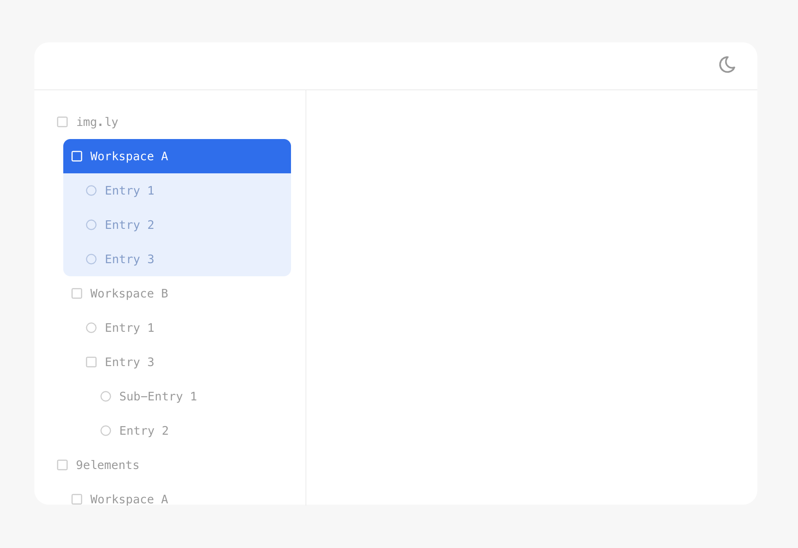

# IMG.LY Home assignment



To run this project in dev mode please ```npm run dev```

Run tests: ```npm run test```

Build static files: ```npm run build```

> [!NOTE]  
> There is a small delay on ```src/services/fetchData.ts:14``` to slow down http requests a bit.